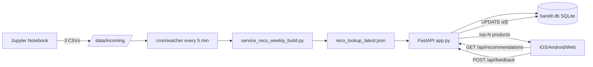

# Onboarding Recommendation Reco — System Architecture

**Purpose**: give a mid-level backend engineer landing on the repo cold enough of a mental model to trace a request end-to-end, run the weekly job, and reason about the two learning loops.

---

## 0. One-line summary

**3-tap onboarding → 60 (style × price × item) cohorts × up to 120-product pool → Thompson sampled top-N → per-event Beta posterior updates → weekly pool rebuild.**

Two learning loops sit side by side:
- **Weekly (batch)** — a human pulls purchase events from the warehouse into three files; the server rebuilds the candidate pool.
- **Realtime (online)** — every quiz + user interaction hits `POST /api/feedback` and updates `bandit.db` in milliseconds.

The app / web client posts events directly to this service. The internal analytics warehouse is used **only** as the weekly pool source, not for realtime attribution.

---

## 1. Architecture Overview

```
┌──────────────────┐
│    Jupyter       │        Once per week, run by a human
│  (weekly_data_   │──┐
│   pull.ipynb)    │  │  3–4 warehouse SQL queries
└──────────────────┘  │  → 3 CSV/parquet files
                      │  → uploaded to /data/incoming/
                      ▼
┌──────────────────────────────────────────────────┐
│                Reco Server (FastAPI)              │
│                                                    │
│  ┌────────────────────────────────────────────┐   │
│  │  cron / file-watcher (every 5 min)         │   │
│  │  detects a fresh, complete file set        │   │
│  │  → runs scripts/service_reco_weekly_build  │   │
│  │  → writes reco_lookup_YYYY-MM-DD.json      │   │
│  │  → atomic-renames reco_lookup_latest.json  │   │
│  └────────────────────────────────────────────┘   │
│                                                    │
│  ┌────────────────────────────────────────────┐   │
│  │  FastAPI · app.py (uvicorn)                │◄──┼── GET /api/recommendations
│  │  · LookupCache reloads on mtime change     │───┼─► top-N products (default 60)
│  │  · Thompson sample from bandit.db          │   │
│  │  · seed_from_lookup(): new products only   │◄──┼── POST /api/feedback
│  │  · rule-based NLU fallback                 │   │      (click/purchase/skip/dwell_2s)
│  └───────┬────────────────────────────────────┘   │
│          │                                         │
│          ▼                                         │
│  ┌────────────────────────────────────────────┐   │
│  │  bandit.db (SQLite · WAL)                  │   │
│  │  · posterior (α, β, counts) per cohort×pid │   │
│  │  · feedback_log (append-only)              │   │
│  └────────────────────────────────────────────┘   │
└──────────────────────────────────────────────────┘
                        ▲
                        │
     ┌──────────────────┴──────────────────┐
     │              Clients                 │
     │  ┌─────────┐  ┌─────────┐  ┌──────┐ │
     │  │  iOS    │  │ Android │  │  Web │ │
     │  └─────────┘  └─────────┘  └──────┘ │
     │  Each client fires POST /api/feedback │
     │  on every relevant user event.        │
     └─────────────────────────────────────┘
```

### Mermaid version



---

## 2. Two learning loops

| Aspect | Weekly (batch) | Realtime (online) |
|---|---|---|
| **What it changes** | The pool itself (product candidates) | Per-product popularity (α, β) inside the pool |
| **Data source** | Warehouse: last 4 weeks of purchases | Client events (client → server) |
| **Storage** | `data/reco_lookup/reco_lookup_latest.json` | `data/bandit.db` (SQLite) |
| **Latency** | Minutes, weekly | Milliseconds, per event |
| **Human step** | Jupyter → upload CSVs (~10 min) | None |
| **Purpose** | Onboard new products, reflect seasons | Absorb user reactions |

Interaction: `seed_from_lookup()` in `app.py` seeds *only new* (cohort × product) pairs. Existing posteriors are preserved so learning accumulates across weekly rebuilds.

---

## 3. Weekly pipeline

### 3.1 Human step (see [docs/WEEKLY_WORKFLOW.md](docs/WEEKLY_WORKFLOW.md))
1. Open `notebooks/weekly_data_pull.ipynb`
2. Run the warehouse SQL cells
3. Save three files (schema in [docs/DATA_SCHEMA.md](docs/DATA_SCHEMA.md)):
   - `events_cohort_slim.csv` — app purchase events
   - `web_events.csv` — web purchase events
   - `user_master_coldstart.parquet` — user profile / app↔web mapping
4. Upload to `data/incoming/` on the server. Done.

### 3.2 Automatic server side
```
every 5 min via cron/inotify:
  1. detect a fresh, complete set in /data/incoming/
  2. move to /data/raw/
  3. run scripts/service_reco_weekly_build.py (~5 min)
  4. write reco_lookup_YYYY-MM-DD.json, atomic-rename → reco_lookup_latest.json
  5. FastAPI LookupCache picks it up on next request (mtime detect)
  6. seed_from_lookup() adds ONLY new (cohort, product) posteriors
  7. optional Slack webhook alert
```

### 3.3 Failure handling
- On build failure the previous `reco_lookup_latest.json` remains live — no downtime.
- Bad inputs are moved to `data/incoming/failed/`.
- Retries happen on the next 5-min tick.

---

## 4. Realtime pipeline

```
Client                                         Server
──────                                         ──────

App first launch
  session_id = uuid()  (persisted client-side)

Quiz answer
  ─────── POST /api/quiz-log ─────────────►  append logs/quiz_log_YYYY-MM-DD.jsonl

Recommendation request
  ─── GET /api/recommendations?style=... ──►  Thompson sample from bandit.db
  ◄── top-N products + matched_key ─────────  record_impressions()

User clicks product P001
  ─── POST /api/feedback (signal=click) ───►  UPDATE alpha = alpha + 1.0
                                              INSERT INTO feedback_log

Card scrolled past
  ─── POST /api/feedback (signal=skip) ────►  UPDATE beta = beta + 0.5

Dwelled 2 seconds
  ─── POST /api/feedback (signal=dwell_2s)─►  UPDATE alpha = alpha + 0.2

User purchases
  ─── POST /api/feedback (signal=purchase)─►  UPDATE alpha = alpha + 5.0
```

### 4.1 Signal weights (see `app.py:246 SIGNAL_UPDATE`)

| Signal | Posterior update | Rationale |
|---|---|---|
| `click` | α += 1.0 | Baseline interest |
| `purchase` | α += 5.0 | Strong positive (conversion) |
| `skip` | β += 0.5 | Weak negative (scrolled past) |
| `dwell_2s` | α += 0.2 | Weak positive (sustained attention) |

The 5× purchase-to-click ratio is a demo default — see [docs/PRODUCTION_ROADMAP.md](docs/PRODUCTION_ROADMAP.md) for the recommended 20–50× re-tuning.

### 4.2 Session tracking
- `session_id` is a UUID persisted in localStorage / UserDefaults / SharedPreferences.
- Server stores it verbatim on quiz-logs and feedback rows for funnel and A/B analysis.
- Cross-device tie-in via `user_id` is left to the client (see roadmap).

---

## 5. Server components

### 5.1 Layout
```
service_app/
├── ARCHITECTURE.md                       # (this file)
├── app.py                                # FastAPI + Thompson sampling + NLU
├── requirements.txt
├── docs/                                 # per-topic specs
├── notebooks/weekly_data_pull.ipynb      # warehouse extract template
├── scripts/service_reco_weekly_build.py  # weekly batch
├── static/                               # 5 quiz UI variants
│   ├── index.html   simple.html   voice.html
│   ├── swipe.html   persona.html
│   └── (assets)
│
└── data/  logs/                          # runtime (gitignored)
    ├── incoming/  raw/  processed/
    ├── reco_lookup/reco_lookup_latest.json
    ├── bandit.db                         # SQLite posterior + feedback log
    └── logs/quiz_log_YYYY-MM-DD.jsonl
```

### 5.2 File lifecycle

| File | Size | Refresh | Owner |
|---|---|---|---|
| `reco_lookup_latest.json` | ~500 KB | Weekly | Weekly batch (auto) |
| `bandit.db` | 10–100 MB | Per event | FastAPI (auto) |
| `logs/quiz_log_*.jsonl` | Proportional to users | Per quiz step | FastAPI (auto) |
| Raw CSV/parquet | Hundreds of MB | Weekly | Jupyter (human upload) |

### 5.3 Five UI variants (`static/`)

Each variant collects the same `(style, price, item)` triple with different UX:

| Route | File | UX pattern |
|---|---|---|
| `/` | `index.html` | Default landing (mascot + chip quiz) |
| `/simple` | `simple.html` | Chip-based 3-step quiz |
| `/voice` | `voice.html` | Natural-language input → `/api/nlu` |
| `/swipe` | `swipe.html` | Tinder-style swipe · lookup inlined server-side as `window.RECO_LOOKUP` |
| `/persona` | `persona.html` | Persona picker |

All five wire `click / skip / purchase` feedback to `/api/feedback`.

---

## 6. Endpoints (see [docs/API_SPEC.md](docs/API_SPEC.md))

### User-facing
- `GET /api/recommendations` — Thompson-sampled top-N (`k`: default 60, range 12–200)
- `POST /api/feedback` — event signal
- `POST /api/nlu` — natural language → structured params (LLM + rule-based fallback)
- `POST /api/quiz-log` — funnel logging
- `GET /api/quiz-config` — UI chip options

### Ops / debug
- `GET /api/health`
- `GET /api/bandit-stats`
- `GET /api/stats/quiz-logs`
- `POST /api/rebuild` — admin-token gated

---

## 7. Deployment summary (see [docs/DEPLOY.md](docs/DEPLOY.md))

The service is a stateful FastAPI process with SQLite persistence, so pure serverless (Vercel Functions, Netlify) is **not** viable without moving the store. Options that work:

| Option | Cost/mo | Complexity | Notes |
|---|---|---|---|
| Docker + any VPS | ~$5–15 | Low | Simplest reproducible path |
| Fly.io | ~$5 | Low | Requires volume mount for `data/` |
| Railway / Render | ~$5–10 | Very low | Attach persistent volume |
| AWS EC2 t3.small | ~$15 | Medium | Full control, systemd + Nginx |
| Vercel (frontend only) | — | — | Only serve static UIs; API stays elsewhere |

The persistent `data/` volume is **mandatory** — SQLite plus lookup JSON must survive restarts.

---

## 8. Algorithm summary

### 8.1 Weekly build
- 4-week rolling window over app + web purchase events
- Per-product signals: `n_bought`, `recency_score` (exp decay half-life 14 d), `is_new`, `is_golf`
- Bayesian-smoothed `base_score = (recency + α) / (cohort_size + β)`
- Boosts: `golf_mult` (1.5 in golf cohort, 0.4 elsewhere), `new_mult` (1.3 if is_new)
- Per cohort: 70 exploit + 50 explore = up to 120 products

### 8.2 Realtime (Thompson sampling)
- Sample `score ~ Beta(α · boost, β)`; boost = 1.3 for explore items
- K = 100 rescaled prior (weakly informative — each click actually shifts the posterior)
- Brand diversity: max `brand_max=4` per brand in the returned pool
- Optional soft OS boost when `os_name=iOS`
- Season / style hygiene filters inside `sample()` (`WINTER_TOKENS`, `GOLF_TOKENS`)

### 8.3 Fallback ladder
1. `style__price__browse` (item relaxed)
2. `sports_casual__price__browse` (style relaxed, price kept)
3. `sports_casual__mid__browse` (last resort)

Details: [docs/MODEL_SPEC.md](docs/MODEL_SPEC.md).

---

## 9. Known limitations

- `is_new` misses products that pre-date the window (see [PRODUCTION_ROADMAP.md](docs/PRODUCTION_ROADMAP.md) → cold-start).
- Golf brand auto-detect at `n≥3` has false-positive risk (raise to `n≥5`).
- Retired products leave orphaned posteriors — filter by current lookup at `sample()` time.
- SQLite `SELECT then UPDATE` is not multi-worker safe; use atomic `UPDATE alpha = alpha + ?` on Postgres for production.
- Category tagging is currently regex-based; embedding-based tagging is on the roadmap.

---

## 10. Related Files

- [README.md](README.md)
- [docs/SETUP.md](docs/SETUP.md)
- [docs/DEPLOY.md](docs/DEPLOY.md)
- [docs/API_SPEC.md](docs/API_SPEC.md)
- [docs/MODEL_SPEC.md](docs/MODEL_SPEC.md)
- [docs/DATA_SCHEMA.md](docs/DATA_SCHEMA.md)
- [docs/WEEKLY_WORKFLOW.md](docs/WEEKLY_WORKFLOW.md)
- [docs/FRONTEND_INTEGRATION.md](docs/FRONTEND_INTEGRATION.md)
- [docs/PRODUCTION_ROADMAP.md](docs/PRODUCTION_ROADMAP.md)
